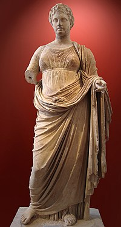
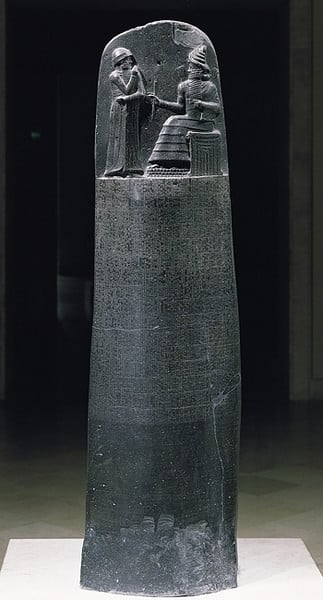

<!-- _class: couv -->

### Droit et Grands Enjeux du Monde Contemporain

# Quizz

## LE DROIT

---

      

## 1) Dans la mythologie grecque, la déesse de la justice est :

    

### - A. Thémis 
### - B. Athéna		
### - C. Hestia

---

## <u>Réponse A</u> : THÉMIS

Thémis est la déesse de la Justice et de la loi dans la mythologie grecque. Elle est représentée les yeux bandés pour montrer son impartialité/objectivité car elle ne voit pas les personnes qui comparaissent devant elle. Elle porte dans une main une balance symbole de l’équilibre de son jugement (arguments à charge à décharge), et dans l’autre main, un glaive/épée symbole de la force et de la puissance. La justice devant trancher et exécuter les jugements.

---

      

## 2) Les premiers textes de droit retrouvés remontent à l’époque :

    

### - A. Egypte antique (environ 5500 avant J.-C)
### - B. Babylonienne (environ 2000 ans avant J.-C)		
### - C. Romaine (environ 500 ans avant J.-C)

---

### <u>Réponse B</u> : Le code Hammurabi

 

Le Code de Hammurabi est un texte juridique babylonien daté d'environ 1750 av. J.-C., à ce jour le plus complet des codes de lois connus de la Mésopotamie antique. Il a été redécouvert en 1901-1902 à Suse en Iran, gravé sur une stèle de 2,25 mètres de haut comportant la quasi-totalité du texte en écriture cunéiforme et en langue akkadienne. 

---

### Loi des Douze Tables

La loi des Douze Tables (en latin : Lex Dvodecim Tabvlarvm ou plus simplement Dvodecim Tabvlae) constitue le premier corpus de lois romaines écrites. Leur rédaction est l'acte fondateur du ius scriptum, le droit écrit. Le corpus est rédigé par un collège de décemvirs entre 451 et 449 av. J.-C. L'apparition de ces lois écrites marque une certaine laïcisation du droit romain, par rapport au ius oral pratiqué auparavant.

---

      

## 2) Dans la mythologie grecque, la déesse de la justice est :

    

### - A. Thémis 
### - B. b. Athéna		
### - C. Hestia

---

      

## 1) Dans la mythologie grecque, la déesse de la justice est :

    

### - A. Thémis 
### - B. b. Athéna		
### - C. Hestia

---

      

## 1) Dans la mythologie grecque, la déesse de la justice est :

    

### - A. Thémis 
### - B. b. Athéna		
### - C. Hestia

---
