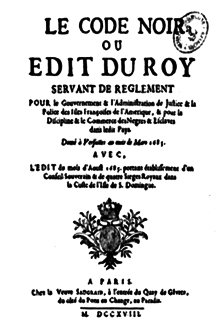

<!-- _class: couv -->

### Droit et Grands Enjeux du Monde Contemporain

# Quizz

## LE DROIT

---

      

## 1) Dans la mythologie grecque, la déesse de la justice est :

    

### - A. Thémis 
### - B. Athéna		
### - C. Hestia

---

### <u>Réponse A</u> : THÉMIS

Thémis est la déesse de la Justice et de la loi dans la mythologie grecque. Elle est représentée les yeux bandés pour montrer son impartialité/objectivité car elle ne voit pas les personnes qui comparaissent devant elle. Elle porte dans une main une balance symbole de l’équilibre de son jugement (arguments à charge à décharge), et dans l’autre main, un glaive/épée symbole de la force et de la puissance. La justice devant trancher et exécuter les jugements.

---

      

## 2) Les premiers textes de droit retrouvés remontent à l’époque :

    

### - A. Egypte antique (environ 5500 avant J.-C)
### - B. Babylonienne (environ 2000 ans avant J.-C)		
### - C. Romaine (environ 500 ans avant J.-C)

---

### <u>Réponse B</u> : Le code Hammurabi

 

Le Code de Hammurabi est un texte juridique babylonien daté d'environ 1750 av. J.-C., à ce jour le plus complet des codes de lois connus de la Mésopotamie antique. Il a été redécouvert en 1901-1902 à Suse en Iran, gravé sur une stèle de 2,25 mètres de haut comportant la quasi-totalité du texte en écriture cunéiforme et en langue akkadienne. 

---

### La Loi des Douze Tables

   

La **loi des Douze Tables** constitue le premier corpus de lois romaines écrites. Leur rédaction est l'acte fondateur du *ius scriptum*, le droit écrit. Le corpus est rédigé entre 451 et 449 av. J.-C. L'apparition de ces lois écrites marque une certaine laïcisation du droit romain, par rapport au *ius oral* pratiqué auparavant.

---

      

## 3) Le "Code Noir" est :

    

### - A. Un code vestimentaire de l'aristocratie française de la Renaissance 
### - B. Un ensemble de textes de loi sur l'esclavage		
### - C. Une règle inventée par Léonard de Vinci en peinture

---

### <u>Réponse B</u> : Un ensemble de textes de loi sur l'esclavage

Le Code Noir est le titre qui a été donné à l’ordonnance royale de Louis XIV touchant la police des îles de l'Amérique française. Par cette ordonnance, Louis XIV légifère notamment sur la condition des esclaves africains, alors présents dans les îles du sud de l'Amérique française. Le Code noir est un des symboles forts de la traite occidentale, car l’ordonnance a contribué à développer, avec les autres puissances européennes, le commerce triangulaire qui sera considérable au XVIIIe siècle. 

---

      

## 4) L'Habeas Corpus est :

    

### - A. Un ensemble de lois sur le respect du corps d'autrui 
### - B. La limite inférieure de taille autorisée en NBA (Championnat de basket-Ball des États-Unis) : 1m80		
### - C. Un concept juridique anglo-saxon qui interdit la prison préventive

---

### <u>Réponse C</u> : Un concept juridique anglo-saxon

L'Habeas corpus est une notion juridique en vigueur au Royaume-unis depuis le Moyen-Âge. Il énonce une liberté fondamentale, celle de ne pas être emprisonné sans jugement, contraire de l'arbitraire qui permet d'arrêter n'importe qui sans raison valable. Toute personne arrêtée a le droit de savoir pourquoi elle est arrêtée et de quoi elle est accusée. Ensuite, elle peut être libérée sous caution, puis amenée dans les jours qui suivent devant un juge.

---

      

## 5) La Déclaration des Droits de l'Homme et du Citoyen a été proclamée en :

    

### - A. 1776 
### - B. 1789		
### - C. 1791

---

### <u>Réponse B</u> : 1789

   

Inspirée de la déclaration de l'Indépendance américaine de **1776** et de l'esprit des Lumières, la Déclaration des droits de l'homme et du citoyen a été proclamée par l'Assemblée constituante française en **1789**. Elle sert de préambule à la première Constitution de la Révolution Française de **1791**.

---

      

## 6) Les femmes ont obtenu le droit de vote en France en :

    

### - 1919 
### - 1929		
### - 1944

---

### <u>Réponse C</u> : 1944

 

- le **4 juin 1919**, le Congrès états-unien vote un amendement constitutionnel qui promet que "le droit de vote des citoyens des États-Unis ne sera ni nié ni restreint par les États-Unis ou par un État en raison du sexe"
- L'Équateur est le premier pays d'Amérique latine à donner le droit de vote aux femmes en **1929**.
- En France, il a fallu attendre le **21 avril 1944** pour que les femmes obtiennent le droit de voter et de se présenter à une élection, après plus de 150 ans de mobilisations civiques.

---

      

## 7) La peine de mort a été abolie en France en :

    

### - A. 1789 
### - B. 1981		
### - C. Jamais

---

### <u>Réponse B</u> : 1981

La France abolit la peine de mort en 1981, devenant le 36e État au monde à adopter une telle mesure. Robert badinter, alors Ministre de la justice, porte le projet de loi.

Hamida Djandoubi, guillotiné le 10 septembre 1977 à la prison des Baumettes de Marseille, est la dernière personne à avoir subi la peine de mort en France.  [L'affaire Christian Ranucci](https://fr.wikipedia.org/wiki/Affaire_Christian_Ranucci), condamné à mort pour le meurtre d'une enfant de 8 ans, a créé la polémique, un journaliste apportant des preuves de son innocence après sa mort. 

---
<!-- _class: video -->

### Discours de Robert Badinter sur l'abolition de la peine de mort, 17 septembre 1981

 

<iframe width="650" height="400" src="https://www.youtube.com/embed/waM7DsuhX28?si=TBLv9JnKegkqfv5C" title="YouTube video player" frameborder="0" allow="accelerometer; autoplay; clipboard-write; encrypted-media; gyroscope; picture-in-picture; web-share" allowfullscreen></iframe>

 

Robert BADINTER, avocat, garde des Sceaux et ministre de la Justice, demande à L'Assemblée nationale l'abolition de la peine de mort.

