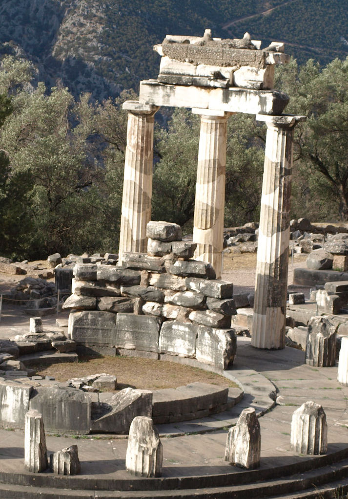

<!-- _class: couv -->

### SPÉCIALITÉ TERMINALE HLP PHILO

# La recherche   de soi

## INTRODUCTION

---

<!-- paginate: true -->

## 1. Qu'est-ce que la recherche de soi ?

 

> « Connais-toi toi-même. » 
> (Inscription au fronton du temple de Delphes)

  

`Comment comprenez-vous cette sentence gravée au fronton du temple de Delphes, où les Athéniens allaient consulter la Pythie, oracle du dieu Apollon ?`

---

<!-- _class: textelong -->

 

### PLATON, *Alcibiade* (Ve s. av. J.-C.)  
 

*1. Quel problème pose Socrate à propos de la connaissance de soi ?*

> (1) SOCRATE : De quelle manière pourrions-nous connaître très lucidement ce « soi-même essentiel » ? Il apparaît que si nous le savions, nous nous connaîtrions aussi nous-mêmes. Mais par les dieux, l'heureuse parole de l'inscription delphique que nous rappelions à l'instant, ne l'entendons-nous pas ? [...] Si c'était à notre regard, comme à un homme, que l'inscription s'adressât en lui donnant ce conseil : « Regarde-toi toi-même » ; comment comprendrions-nous le sens de cet avis ? Ne serait-ce pas destiner l'oeil à porter son regard sur un objet dans lequel il se verrait lui-même ?
> (2) ALCIBIADE : C'est clair.

 

---
<!-- _class: textelong -->

*2. Expliquez la métaphore du miroir qu'utilise Socrate. A quoi sert-elle ?*
>(3) SOCRATE : Demandons donc quel est, parmi les objets, celui sur lequel il faut diriger notre regard pour voir en même temps cet objet et nous-mêmes ?  (4) ALCIBIADE : À l'évidence, Socrate, un miroir ou un objet du même type ?  (5) SOCRATE : C'est juste. Mais l'oeil, moyen de notre vision, ne renferme-t-il pas quelque chose semblable à un miroir ? (6) ALCIBIADE : Absolument.  (7) SOCRATE : Tu as sans doute remarqué, qu'en portant son regard sur l'oeil de quelqu'un qui nous fait face, notre visage se réfléchit dans ce qu'on appelle aussi sa pupille, comme en un miroir ; celui qui porte ainsi son regard, y voit son image.  (8) ALCIBIADE : Tu dis vrai.  (9) SOCRATE : Ainsi donc, un oeil contemplant un autre oeil et dirigeant son regard sur ce qu'il y a de meilleur en lui, c'est-à-dire vers cette pupille qui est le moyen de sa vision, peut ainsi se voir lui-même. (10) ALCIBIADE : Évidemment.  (11) SOCRATE : Mais s'il venait à jeter son regard sur quelque autre partie du corps de l'homme, ou sur quelque autre objet, sauf celui auquel l'oeil se trouve être semblable, il ne se verrait nullement lui-même. (12) ALCIBIADE : Tu dis vrai.  (13) SOCRATE : Il en résulte que si l'oeil veut se voir lui-même, c'est sur un oeil qu'il doit porter son regard et sur cette partie de l'oeil où se trouve sa capacité propre, c'est-à-dire, je pense, la vision ?  

---
<!-- _class: textelong -->

 

*3. Comment peut-on se connaître soi-même ? (§15 à §19)*

 

>(15) SOCRATE : Eh bien, cher Alcibiade, l'âme à son tour, si elle veut se connaître elle-même, n'est-ce pas vers une âme qu'elle doit regarder et surtout vers cette partie de l'âme en laquelle réside la capacité propre d'une âme, la sagesse, ou encore vers telle autre partie qui lui est semblable ?  (16) ALCIBIADE : C'est bien mon sentiment, Socrate.  (17) SOCRATE : Or, sommes-nous à même de dire qu'il y ait dans l'âme quelque réalité plus divine que celle qui se rattache à la connaissance et à la pensée ?  (18) ALCIBIADE : Nous n'en sommes pas capables.  (19) SOCRATE : C'est donc au Divin que ressemble cette capacité de l'âme, et quand on jette le regard vers elle et que l'on reconnaît tout ce qu'elle a de divin, Dieu et la pensée, c'est alors qu'on est bien prêt de se connaître parfaitement soi-même.

---
<!-- _class: textelong -->

 

### ARISTOTE, *La grande morale*

*1. Pourquoi la connaissance de soi est-elle, selon Aristote, très difficile ? 2. Comment peut-on y parvenir ?*

 

>Apprendre à se connaître est très difficile (...) et un très grand plaisir en même temps (quel plaisir de se connaître !) ; mais nous ne pouvons pas nous contempler nous-mêmes à partir de nous-mêmes : ce qui le prouve, ce sont les reproches que nous adressons à d'autres, sans nous rendre compte que nous commettons les mêmes erreurs, aveuglés que nous sommes, pour beaucoup d'entre nous, par l'indulgence et la passion qui nous empêchent de juger correctement. Par conséquent, à la façon dont nous regardons dans un miroir quand nous voulons voir notre visage, quand nous voulons apprendre à nous connaître, c'est en tournant nos regards vers notre ami que nous pourrions nous découvrir, puisqu'un ami est un autre soi-même. Concluons : la connaissance de soi est un plaisir qui n'est pas possible sans la présence de quelqu'un d'autre qui soit notre ami ; l'homme qui se suffit à soi-même aurait donc besoin d'amitié pour apprendre à se connaître soi-même.

---
<!-- _class: video -->

<iframe width="800" height="450" src="https://www.youtube.com/embed/xvc229YVRPc" title="YouTube video player" frameborder="0" allow="accelerometer; autoplay; clipboard-write; encrypted-media; gyroscope; picture-in-picture; web-share" allowfullscreen></iframe>

`Selon Jean-Pierre Vernant, spécialiste de la Grèce antique, qu'est-ce qui distingue l'idée que se faisaient les grecs du "moi" et celle que nous nous en faisons aujourd'hui ?` 

---
 

## 2. Peut-on se connaître soi-même ? 

 

### NIETZSCHE, *Considérations inactuelles* (1873)

 

*1. Pourquoi, selon Nietzsche, la connaissance de soi est « une chose obscure et voilée » ?* 

*2. Pourquoi est-ce une quête « pénible et dangereuse » ?*

*3. Comment, finalement, peut-on se connaitre soi-même ?*

---
<!-- _class: textelong -->

>Mais comment nous retrouver nous-mêmes ? Comment l'homme peut-il se  connaître ? C'est une chose obscure et voilée. Et s'il est vrai que le lièvre a sept peaux, l'homme peut se dépouiller de soixante-dix fois sept peaux avant de pouvoir se dire : « Voici vraiment ce que tu es, ce n'est plus une enveloppe ». C'est par surcroît une entreprise pénible et dangereuse que de fouiller ainsi en soi-même et de descendre de force, par le plus court chemin, jusqu'au tréfonds de son être. Combien l'on  risque de se blesser, si grièvement qu'aucun médecin ne pourra nous  guérir ! Et de plus, est-ce bien nécessaire alors que tout porte  témoignage de ce que nous sommes, nos amitiés comme nos haines, notre regard et la pression de notre main, notre mémoire et nos oublis, nos livres et les traits que trace notre plume ? Mais voici comment il faut  instaurer l'interrogatoire essentiel entre tous. Que la jeune âme [...]  se demande : « Qu'as-tu vraiment aimé jusqu'à ce jour ? Vers quoi t'es-tu sentie attirée, par quoi t'es-tu sentie dominée et comblée à la fois ? »  Fais repasser sous tes yeux la série entière de ces objets de  vénération, et peut-être, par leur nature et leur succession, te révèleront-ils la loi fondamentale de ton vrai moi. Compare ces objets  entre eux, vois comment ils se complètent, s'élargissent, se surpassent, s'illuminent mutuellement, comment ils forment une échelle graduée qui  t'a servi à t'élever jusqu'à ton moi. Car ton être vrai n'est pas caché  tout au fond de toi : il est placé infiniment au-dessus de toi, à tout  le moins au-dessus de ce que tu prends communément pour ton moi.

---
<!-- _class: textelong -->

### MONTAIGNE, *Essais* (1580)

 *<u>Exercice</u> : pour chacune des 4 citations, expliquez en quoi Montaigne rejette la possibilité  de la connaissance de soi*.

  

> « Je n’ai rien à dire de moi entièrement, simplement et solidement, sans confusion et sans mélange, ni en un mot. » (*Essais, II, chap. I*) 

> « Nous sommes tous de lopins, et d’une contexture si informe et diverse que chaque pièce, chaque moment fait son jeu. Et se trouve autant de différence de nous à nous-mêmes que de nous à autrui. » (*Essais, II, chap. I*) 

> « Nous sommes, je ne sais comment, doubles en nous- mêmes. » (*Essais, II, chap. XVI*) 

> « Moi à cette heure et moi tantôt sommes bien deux ». (*Essais, III, chap. IX*) 

---
### PLATON, *Alcibiade* 
   

`Travail de groupe : préparez le brouillon d'une question type bac et présentez votre réponse à l'oral.`
`1. Question d'interprétation philosophique : Quel type de regard doit-on porter sur soi-même afin de mieux se connaître?`
`2. Question de réflexion philosophique : La recherche de soi est-elle une entreprise vaine ? [Utiliser les autres textes et vos propres connaissances pour nourrir votre réflexion]`

