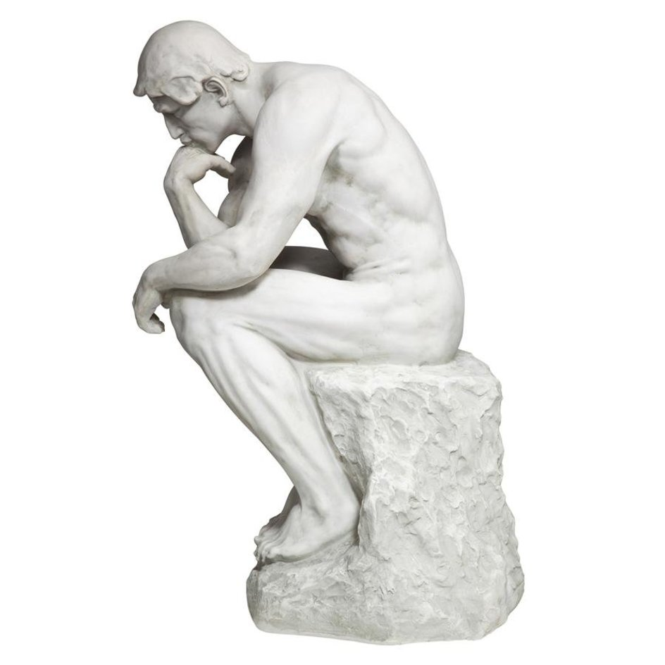
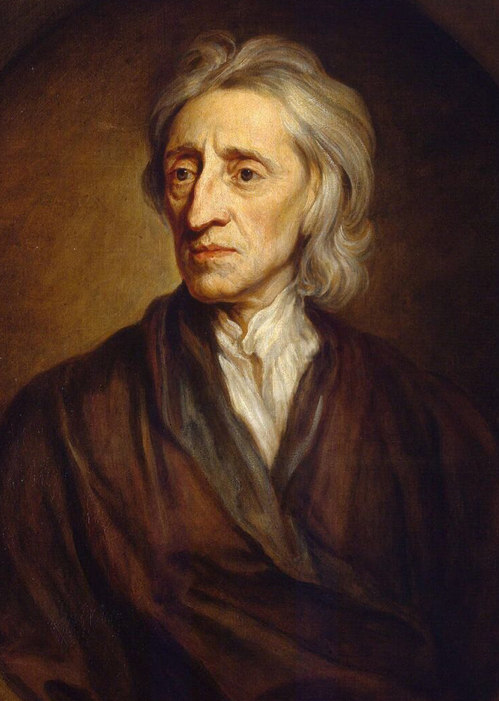
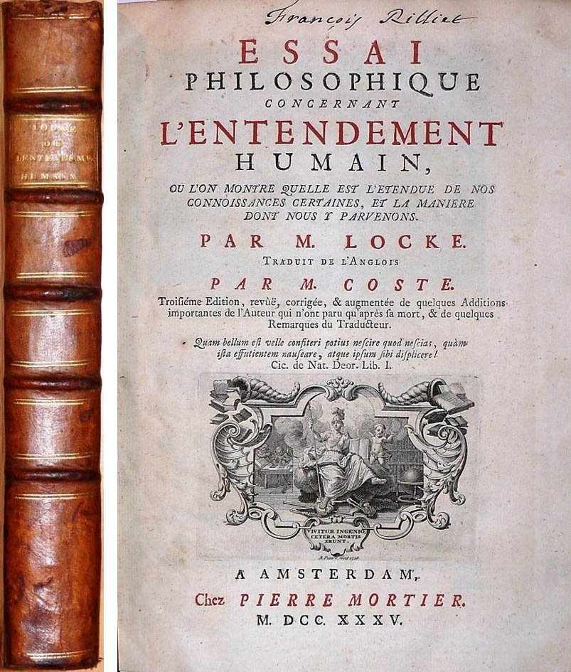

<!-- _class: couv -->

### SPÉCIALITÉ TERMINALE HLP PHILO

 

## | Semestre 1 | Leçon 1 |    **Qu'est-ce qu'une personne ?**

---

<!-- paginate: true -->

# 1. Que nous apprend l'introspection ?

 

### INTROSPECTION ?
` - Sens courant : Observation, examen, regard attentif sur soi-même.`

` - Sens philosophique : effort d'une conscience qui se prend comme objet dans un but de connaissance de soi`

---

## 1.1. Je suis une chose qui pense 

    

### Questions sur le texte de Descartes 

 

1. Premier extrait : expliquez la démarche qui mène Descartes à affirmer :  « *... cette proposition :* Je suis, j'existe, *est nécessairement vraie, toutes les fois que je la prononce, ou que je la conçois en mon esprit* ». Que signifie cette conclusion? 
 
2. Second extrait : Que répond Descartes à la question "Que suis-je" ? Que peut-on en conclure sur notre identité personnelle ?

---

<!-- _class: textelong -->

### DESCARTES, *Méditations métaphysiques, II* (1641)  

> **Extrait n°1**
>Je suppose donc que toutes les choses que je vois sont fausses ; je me persuade que rien n'a jamais été de tout ce que ma mémoire remplie de mensonges me représente ; je pense n'avoir aucun sens ; je crois que le corps, la figure, l'étendue, le mouvement et le lieu ne sont que des fictions de mon esprit. Qu'est-ce donc qui pourra être estimé véritable ? Peut-être rien autre chose, sinon qu'il n'y a rien au monde de certain. (...)  Ne me suis-je donc pas aussi persuadé que je n'étais point ? Non certes, j'étais sans doute, si je me suis persuadé, ou seulement si j'ai pensé quelque chose. (...)  De sorte qu'après y avoir bien pensé, et avoir soigneusement examiné toutes choses enfin il faut conclure, et tenir pour constant que cette proposition: *Je suis, j'existe*, est nécessairement vraie, toutes les fois que je la prononce, ou que je la conçois en mon esprit.

> **Extrait n°2**
>Mais qu'est-ce donc que je suis ? Une chose qui pense. Qu'est-ce qu'une chose qui pense ? C'est-à-dire une chose qui doute, qui conçoit, qui affirme, qui nie, qui veut, qui ne veut pas, qui imagine aussi, et qui sent.

---
## 1.2. L'identité introuvable

### Questions sur le texte de Hume

1. Que saisissons-nous par le moyen de l'introspection, selon David Hume ?

2. Pourquoi l'identité personnelle est-elle « fictive » ?

3. Que peut-on en conclure sur notre identité personnelle ?

### Complément - Oliver Sacks, *L'homme qui prenait sa femme pour un chapeau* (1985)

1. Oliver Sacks est un psychiatre et neurologue anglais. Résumez le cas de Jimmie, qui souffre d'amnésie rétrograde et d'un trouble del'identité 

2. En quoi ce cas illustre-t-il la thèse de Hume sur l'identité personnelle ?

3. En quoi est-ce un trouble de l'identité ?

---
<!-- _class: textelong -->

### DAVID HUME, *Traité de la nature humaine* (1739)

>Pour moi, quand je pénètre le plus intimement dans ce que j’appelle *moi-même*, je tombe toujours sur une perception particulière ou sur une autre, de chaleur ou de froid, de lumière ou d’ombre, d’amour ou de haine, de douleur ou de plaisir. Je ne parviens jamais, à aucun moment, à me saisir moi-même sans une perception et je ne peux jamais rien observer d’autre que la perception. […] [Je suis] un faisceau ou une collection de perceptions différentes, qui se succèdent avec une rapidité inconcevable et sont dans un flux et un mouvement perpétuels. […] L’esprit est une sorte de théâtre, où des perceptions diverses font successivement leur entrée, passent, repassent, s’esquivent et se mêlent en une variété infinie de positions et de situations. Il n’y a pas en lui à proprement de *simplicité* à un moment donné, ni d’identité à différents moments, quelque tendance naturelle que nous puissions avoir à imaginer cette simplicité et cette identité. La comparaison du théâtre ne doit pas nous égarer. Ce ne sont que les perceptions successives qui constituent l’esprit, et nous n’avons pas la plus lointaine idée du lieu où ces scènes sont représentées, ni des matériaux dont il est composé. […] L’identité que nous attribuons à l’esprit de l’homme n’est qu’une identité fictive (…). Puisque seule la mémoire nous informe de la continuité et de l’étendue de cette suite de perceptions, elle doit être considérée, principalement pour cette raison, comme la source de l’identité personnelle.

---

# 2. Qu'est-ce qui fait de moi une seule et même personne ?

    

### Extraits de **John Locke, *Essai sur l’entendement humain*, livre II, chap. 27 (1690)**

---

 

## 2.1. Suis-je mon corps ?

  

### Questions sur le texte n°1

 

1. **§9** - Qu'est-ce qu'une personne, selon Locke ? 
 
2. Qu'est-ce qui nous permet de savoir que nous sommes une personne ?
 
3. **§9 et §16** - Sur quoi repose l'identité de notre personne à travers le temps ?

---

<!-- _class: textelong -->

>**§ 9.** *Identité personnelle*. Il nous faut considérer ce que représente la personne ; c’est, je pense, un être pensant et intelligent, doué de raison et de réflexion, et qui peut se considérer soi-même comme soi-même, une même chose pensante en différents temps et lieux. Ce qui provient uniquement de cette conscience qui est inséparable de la pensée, et lui est essentielle à ce qu’il me semble : car il est impossible à quelqu’un de percevoir sans percevoir aussi qu’il perçoit. Quand nous voyons, entendons, sentons par l’odorat ou le toucher, éprouvons, méditons ou voulons quelque chose, nous savons que nous le faisons. Il en va toujours ainsi de nos sensations et de nos perceptions présentes : ce par quoi chacun est pour lui-même précisément ce qu’il appelle soi, laissant pour l’instant de côté la question de savoir si le même soi continue d’exister dans la même substance ou dans plusieurs. Car la conscience accompagne toujours la pensée, elle est ce qui fait que chacun est ce qu’il appelle soi et qu’il se distingue de toutes les autres choses pensantes. Mais l’identité personnelle, autrement dit la mêmeté ou le fait pour un être rationnel d’être le même, ne consiste en rien d’autre que cela. L’identité de telle personne s’étend aussi loin que cette conscience peu atteindre rétrospectivement toute action ou pensée passée ; c’est le même soi maintenant qu’alors, et le soi qui a exécuté cette action qui, à présent, réfléchit sur elle.
> #### John Locke, *Essai sur l’entendement humain*, II, 27, §9

---
<!-- _class: textelong -->

 

>**§ 16.** *La conscience fait la même personne*. On voit que la même substance immatérielle ou âme ne suffit pas, où qu’elle soit située et quel que soit son état, à faire à elle seule le même homme. En revanche il est manifeste que la simple conscience, aussi loin qu’elle peut atteindre, même si c’est à des époques historiques passées, réunit des existences et des actions éloignées dans le temps au sein de la même personne aussi bien qu’elle le fait pour l’existence et les actions du moment immédiatement précédent. En sorte que tout ce qui a la conscience d’actions présentes et passées est la même personne à laquelle elles appartiennent ensemble. Si j’avais conscience d’avoir vu l’Arche et le Déluge de Noé comme j’ai conscience d’avoir vu une crue de la Tamise l’hiver dernier, ou comme j’ai conscience maintenant d’écrire, je ne pourrais pas plus douter que moi qui écris ceci maintenant, qui ai vu la Tamise déborder l’hiver dernier, et qui aurais vu la terre noyée par le Déluge, j’étais le même soi ou moi-même que j’étais hier, tandis qu’à présent j’écris (que je sois entièrement constitué ou non de la même substance, matérielle ou immatérielle). Car pour ce qui est de la question de savoir si je suis le même soi, il importe peu que ce soi d’aujourd’hui soit fait de la même substance ou d’autres.
> #### John Locke, *Essai sur l’entendement humain*, II, 27, §16

---
<!-- _class: textelong -->

# 2.2. Puis-je être quelqu'un d'autre ?

 

> **§ 15.** Que l’âme d’un prince, emportant avec elle la conscience de sa vie passée de prince, venait à entrer dans le corps d’un savetier et à s’incarner en lui à peine celui-ci abandonné par son âme, chacun voit bien qu’il serait la même personne que ce prince, et responsable seulement de ses actes : mais qui dirait que c’est le même homme ? Le corps lui aussi entre dans la constitution de l’homme, tandis que l’âme, avec toutes ses pensées princières, ne ferait pas un autre homme, mais il demeurerait le même savetier pour tous, sauf pour lui-même.
> #### John Locke, *Essai sur l’entendement humain*, II, 27, 9 § 15

 

1. Ecrivez-une courte fiction qui mette en scène l'expérience de pensée proposée par Locke (choisissez d'autres personnages) 
2. En quoi cette expérience de pensée permet-elle de différencier "l'homme" de la "personne" ?
3. En quoi montre-t-elle que l'identité de la personne repose sur la conscience ?

---
<!-- _class: textelong -->

# Complément - Extrait de *Philosophie et Science-Fiction*

 

> En 1963, Robert J. White, à Cleveland, entreprit une expérience d'un goût douteux. Avec ses assistants, il était parvenu à exciser un cerveau de singe hors de sa boîte crânienne et à le faire vivre sous circulation artificielle pendant quelques heures. L'électro-encéphalogramme révélait une activité électrique proche de la normale. Le cerveau semblait avoir conservé ses fonctions. A la même époque, d'autres chirurgiens rendirent compte d'expériences analogues dans lesquelles des cerveaux de chiens décapités étaient maintenus artificiellement en état de fonctionnement. L'équipe de White ne s'arrêta pas en si bon chemin. Les cerveaux de singes furent bientôt greffés sur des corps de singes préalablement décapités. Les cerveaux greffés pouvaient ainsi être maintenus en activité pendant quelques jours. White ne se souciait sans doute pas des implications philosophiques de ses expériences. Mais, lors d'une interview donnée à la télévision en 1966, il affirma sans détour qu'il serait possible de greffer un cerveau humain de la même manière.

Quels problèmes poseraient ces expérimentations de Robert J. White si elles étaient réellement mises en œuvre sur des êtres humains ?

---
<!-- _class: video -->

### Souvenirs à vendre (Philip K. Dick) / Total Recall 

<iframe width="800" height="450" src="https://www.youtube.com/embed/xvc229YVRPc" title="YouTube video player" frameborder="0" allow="accelerometer; autoplay; clipboard-write; encrypted-media; gyroscope; picture-in-picture; web-share" allowfullscreen></iframe>

`Rédigez un paragraphe dans lequel vous comparez l'expérience de pensée de J. Locke et l'extrait de la nouvelle de Philip K. Dick, et montrez quelle thèse cela permet d'illustrer.` 

---
<!-- _class: textelong -->

# 2.3. Puis-je être deux personnes ou plus en une seule ?

 

> § 19. Ceci peut nous faire voir en quoi consiste l’identité personnelle : non dans l’identité de substance mais, comme je l’ai dit, dans l’identité de conscience, en sorte que si Socrate et l’actuel maire de Quinborough (1) en conviennent, ils sont la même personne, tandis que si le même Socrate éveillé et endormi ne partagent pas la même conscience, Socrate éveillé et Socrate dormant n’est pas la même personne. Et punir Socrate l’éveillé pour ce que Socrate le dormant a pu penser, et dont Socrate l’éveillé n’a jamais eu conscience, ne serait pas plus juste que de punir un jumeau pour les actes de son frère jumeau et dont il n’a rien su, sous prétexte que leur forme extérieure est si semblable qu’ils sont indiscernables (or on a vu de tels jumeaux).  *(1) Quinborough : ville du sud-est de l’Angleterre.*
> #### John Locke, *Essai sur l’entendement humain*, II, 27, §19

1. Expliquez les deux cas proposés par J. Locke dans cette expérience de pensée

2. Pourquoi Socrate éveillé et Socrate endormi ne sont-ils pas la même personne selon Locke ?

3. Qu’est-ce qui permet au Moi de demeurer le même ?

---

 

##  Complément : *L’étrange cas du dr Jekyll et de mr Hyde* (R. L. Stevenson)

   

1. Résumez l'extait distribué de *"L’étrange cas du dr Jekyll et de mr Hyde"*

2. En quoi illustre-t-il l'expérience de pensée de J. Locke sur Socrate et le maire de Quinborough ?

---
<!-- _class: video -->

### Extrait n°1 : adaptation cinématographique de 1931 

   

<iframe src="https://drive.google.com/file/d/1-PeT-K2SGfyeeTaPWu_V0V5RG9navIkQ/preview" width="800" height="450" allow="autoplay"></iframe>

---

<!-- _class: video -->

### Extrait n°2 : adaptation cinématographique de 1941 

   

<iframe src="https://drive.google.com/file/d/1-Vbe5O5cJjai30unRJlAPwtFF3Z0R2Lt/preview" width="800" height="450" allow="autoplay"></iframe>

