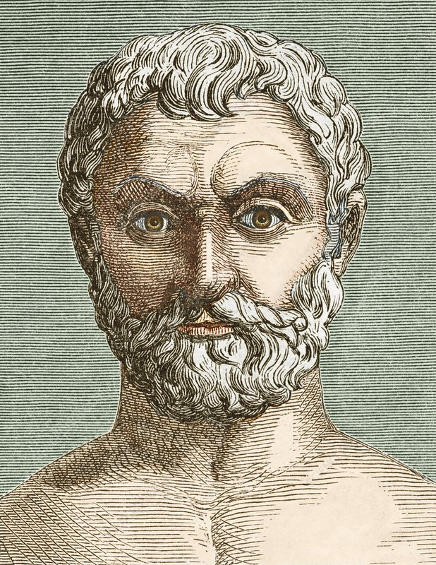
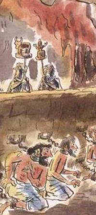

<!-- _class: couv -->

### PHILOSOPHIE TERMINALE TRONC COMMUN
# LEÇON 1
## L'allégorie de la caverne

    

#### navigation : ← →

---
<!-- paginate: true -->
<!-- _class: partie -->

# INTRODUCTION :   Qu'est-ce que la philosophie ?

  

`Exercice n°1 - Que vous évoque le mot "philosophie" ?`

`Exercice n°2 - Dans cet extrait du Mariage Forcé de Molière, l’auteur se moque du philosophe Marphurius, auquel Sganarelle vient demander conseil à propos de son mariage. Que lui reproche-t-il ?`

---
<!-- _class: texte -->

> MARPHURIUS – Que voulez-vous de moi, Seigneur Sganarelle ? 
SGANARELLE – Seigneur Docteur, j'aurais besoin de votre conseil sur une petite affaire dont il s’agit ; et je suis venu ici pour cela. (…) 
MARPHURIUS. – Seigneur Sganarelle, changez, s'il vous plaît, cette façon de parler. Notre philosophie ordonne de ne point énoncer de proposition décisive ; de parler de tout avec incertitude ; de suspendre toujours son jugement : et par cette raison vous ne devez pas dire "Je suis venu" ; mais "Il me semble que je suis venu." (…) 
SGANARELLE – Comment, il n'est pas vrai que je suis venu ? 
MARPHURIUS – Cela est incertain ; et nous devons douter de tout. 
SGANARELLE – Quoi ? Je ne suis pas ici ; et vous ne me parlez pas ? 
MARPHURIUS – Il m'apparaît que vous êtes là, et il me semble que je vous parle : mais il n'est pas assuré que cela soit. 

## MOLIÈRE, *Le mariage forcé* (1664)

---

           

`Exercice n°3 - Lire les deux textes suivants et répondre : en quoi ces deux anecdotes sur Thalès donnent-elles deux images radicalement différentes de la philosophie ?`

---
<!-- _class: texte -->

> SOCRATE – L’exemple de Thalès te le fera comprendre, Théodore. Il  observait les astres et, comme il avait les yeux au ciel, il tomba dans  un puits. Une servante de Thrace, fine et spirituelle, le railla,  dit-on, en disant qu’il s’évertuait à savoir ce qui se passait dans le  ciel, et qu’il ne prenait pas garde à ce qui était devant lui et à ses  pieds. La même plaisanterie s’applique à tous ceux qui passent leur vie à philosopher. Il est certain, en effet, qu’un tel homme ne connaît ni  proche, ni voisin ; il ne sait pas ce qu’ils font, sait à peine si ce sont des hommes ou des créatures d’une autre espèce ; mais qu’est-ce que peut être l’homme et qu’est-ce qu’une telle nature doit faire ou supporter qui la distingue des autres êtres, voilà ce qu’il cherche et  prend peine à découvrir. Tu comprends, je pense, Théodore ; ne  comprends-tu pas ?   THÉODORE – Si, et je pense que tu dis vrai.
> ## PLATON, *Théétète* (Ve s. av. J.-C.)

---
<!-- _class: texte -->

> Tous ces moyens sont en effet utiles à ceux qui font grand cas de l'art d'acquérir, par exemple Thalès de Milet. Il est en effet l'auteur d'un stratagème spéculatif, qui, même si c'est à lui qu'on l'attribue à cause de sa science, a néanmoins une portée générale. Comme, voyant sa pauvreté, les gens lui faisaient reproche de l'inutilité de la philosophie, on dit que grâce à l'astronomie il prévit une récolte abondante d'olives. Alors qu'on était encore en hiver, il parvint, avec le peu de biens qu'il avait, à verser des arrhes pour prendre à ferme tous les pressoirs à huile de Milet et de Chios, ce qui lui coûta peu puisque personne ne surenchérit. Puis vint le moment favorable : comme on cherchait beaucoup de pressoirs en même temps et sans délai, il les sous-loua aux conditions qu'il voulut. En amassant ainsi une grande fortune il montra qu'il est facile aux philosophes de s'enrichir s'ils le veulent, mais que ce n'est pas de cela qu'ils se soucient. C'est ainsi, dit-on, que Thalès montra sa science. 
> #### ARISTOTE, *Politique* (IVe s. av. J.-C.)

--- 

## L'Apologie de Socrate 
  
L'apologie de Socrate est un dialogue de Platon qui met en scène le procès de Socrate, accusé d'impiété et d'avoir corrompu la jeunesse. Dans cet extrait, Socrate se défend en expliquant pourquoi, selon lui, il s'est fait des ennemis à Athènes. Il raconte comment l'oracle de Delphes (la Pythie), prêtresse du dieu Apollon, a un jour affirmé qu'il était l'homme le plus sage d'Athènes.

---
### Questionnaire sur l'extrait de *L'Apologie de Socrate* (Platon)
 

`1. (§1 et début §2) Que dit l'oracle de Delphes de Socrate ? Pourquoi Socrate est-il étonné de cette affirmation ? Comment va-t-il réagir ?` 

`2. (§2) Quelle découverte Socrate fait-il après avoir interrogé un homme d'État athénien ?`

`3. (§3) Comment Socrate interprète-t-il finalement les paroles de l'oracle de Delphes ?`

`4. En quoi la dernière phrase du texte pourrait être une définition du philosophe ? Aidez-vous pour répondre de l'étymologie grecque du mot philosophie (philia = amour, désir ; sophia = sagesse).`

---
<!-- _class: texte -->

> **§1.** Vous connaissez certainement Chéréphon. Lui et moi, nous étions amis d'enfance (...). Un jour qu'il était allé à Delphes, il osa poser au dieu la question que voici — de grâce, juges, ne vous récriez pas en l'entendant — il demanda donc s'il y avait quelqu'un de plus savant que moi. Or, la Pythie lui répondit que nul n'était plus savant. (...) Lorsque je connus cet oracle, je me dis à moi-même : « Voyons, que signifie la parole du dieu ? Quel sens y est caché ? J'ai conscience, moi, que je ne suis savant ni peu ni beaucoup. Que veut-il donc dire, quand il affirme que je suis le plus savant ? Il ne parle pourtant pas contre la vérité ; cela ne lui est pas possible. » Longtemps, je demeurai sans y rien comprendre. Enfin, bien à contrecœur, je me décidai à vérifier la chose de la façon suivante.
> **§2.** J'allai trouver un des hommes qui passaient pour savants, certain que je pourrais là, ou nulle part, contrôler l'oracle et ensuite lui dire nettement : « Voilà quelqu'un qui est plus savant que moi, et toi, tu m'as proclamé plus savant. » 

---
<!-- _class: texte -->

> J'examinai donc à fond mon homme ; inutile de le nommer, c'était un de nos hommes d'État ; or, à l'épreuve, en causant avec lui, voici l'impression que j'ai eue, Athéniens. Il me parut que ce personnage semblait savant à beaucoup de gens et surtout à lui-même, mais qu'il ne l'était aucunement. Et alors, j'essayais de lui démontrer qu'en se croyant savant il ne l'était pas. Le résultat fut que je m'attirai son inimitié, et aussi celle de plusieurs des assistants. Je me retirai, en me disant : « À tout prendre, je suis plus savant que lui. En effet, il se peut que ni l'un ni l'autre de nous ne sache rien de bon ; seulement, lui croit qu'il sait, bien qu'il ne sache pas ; tandis que moi, si je ne sais rien, je ne crois pas non plus rien savoir. Il me semble, en somme, que je suis tant soit peu plus savant que lui, en ceci du moins que je ne crois pas savoir ce que je ne sais pas. » Après cela, j'en allai trouver un second, un de ceux qui passaient pour encore plus savants. Et mon impression fut la même. Du coup, je m'attirai aussi l'inimitié de celui-ci et de plusieurs autres. (...)

---
<!-- _class: texte -->

   

> §3. Telle fut, Athéniens, l'enquête qui m'a fait tant d'ennemis, des ennemis très passionnés, très malfaisants, qui ont propagé tant de calomnies et m'ont fait ce renom de savant. Car, chaque fois que je convaincs quelqu'un d'ignorance, les assistants s'imaginent que je sais tout ce qu'il ignore. En réalité, juges, c'est probablement le dieu qui le sait, et, par cet oracle, il a voulu déclarer que la science humaine est peu de chose ou même qu'elle n'est rien. Et, manifestement, s'il a nommé Socrate, c'est qu'il se servait de mon nom pour me prendre comme exemple. Cela revenait à dire : « Ô humains, celui-là, parmi vous, est le plus savant qui sait, comme Socrate, qu'en fin de compte son savoir est nul. »
>
###### PLATON, *Apologie de Socrate* (Ve s. av. J.-C.)

---

## Qu'est-ce que croire et savoir ?

  

`1. Reproduire et remplir le tableau suivant`

`2. Synthétiser le tableau en expliquant ce qui distingue la croyance du savoir`

 

|                                                | "Je crois que..." | "Je crois en..." | "Je sais que..." |
| ---------------------------------------------- | ----------------- | ---------------- | ---------------- |
| Trouver des  synonymes  et illustrer |                   |                  |                  |
| Définir                                        |                   |                  |                  |
| Synthèse                                       |                   |                  |                  |

---
<!-- _class: partie -->

# L'ALLÉGORIE DE LA CAVERNE
---
<!-- _class: video -->

 

### L'allégorie lue et illustrée

   

<video controls width="800">
  <source src="../../assets/vid/allegorie.mp4" type="video/mp4">
  
Votre navigateur ne prend pas en charge les vidéos HTML5.
     Voici <a href="../../assets/vid/allegorie.mp4">un lien pour télécharger la vidéo</a>.

</video>

---

### Questionnaire sur l'extrait à lire de l'allégorie de la caverne
 

`1. Faites un dessin simple de l'allégorie, en le divisant en 2 : l'intérieur de la caverne en bas, l'extérieur en haut` 

`2. Résumez l'allégorie en quelques phrases et en la divisant en 4 étapes` 

`3. Qu'est-ce qu'une allégorie ? Quel est donc le but de Platon en racontant cette histoire ? (voir la première phrase, et les &4 et début du &5)`

---
(suite)

`4. Analyse des éléments de l'allégorie : l'intérieur de la caverne. Faites un tableau avec, dans la colonne de gauche : la caverne / les prisonniers enchaînés / les ombres au fond de la caverne / les marionnettistes / les objets qui défilent / le prisonnier qui s'évade ; dans la colonne de droite, expliquez ce que symbolisent ces éléments. `

`5. Analyse des éléments de l'allégorie : l'extérieur de la caverne. Faites un tableau avec, dans la colonne de gauche : le monde extérieur / la découverte progressive de ce monde extérieur / le soleil ; dans la colonne de droite, expliquez ce que symbolisent ces éléments. `

`6. Pourquoi le prisonnier redescend-il dans la caverne, et que lui arrive-t-il ? Comment interpréter cela ? `

`7. Quel enseignement général peut-on tirer selon vous de cette allégorie ? Que veut nous dire Platon ? (Utilisez l'aide)`

---

### Aide pour la compréhension de l'allégorie
L'allégorie peut être interprétée d'un point de vue épistémologique (1) et ontologique (2) :

(1)	"épistémologique" (du grec "epistémé" : connaissance) est un adjectif qui renvoie à la connaissance, le savoir, notre manière de comprendre le monde.  

(2)	"ontologique" (du grec "ontos" : être) est un adjectif qui renvoie à la réalité, le monde, "l'être" des choses.

Pour comprendre l'allégorie, il faut donc se poser deux questions :

(1)	(sens épistémologique de l'allégorie) : Que nous dit Platon à propos de notre rapport au savoir, de notre compréhension des choses ?

(2)	(sens ontologique de l'allégorie) : Que nous dit Platon à propos du monde, de la réalité ? 

---
<!-- _class: partie -->

# CONCLUSION :   Qu'est-ce que penser ?

   

> « La pensée est le dialogue intérieur et silencieux de l'âme avec elle-même » (Platon, *Le sophiste*)

---

## Questionnaire sur le texte d'Alain :   "Penser, c'est dire non"

    

**Ce questionnaire vous guide dans la compréhension de ce texte (voir la fiche-méthode : lire et comprendre un texte philosophique).** 

**Utilisez des stylos et surligneurs de couleurs différentes pour situer dans le texte les éléments visibles (thèse, arguments, exemples, concepts principaux, etc.).** 

**Dans la colonne de gauche, prenez de courtes notes pour identifier les différents éléments du texte (Q, T, A, E, Pb).**

---
<!-- _class: textelong -->

`1. Quelle est la question principale que se pose Alain dans ce texte ? (Attention : elle est implicite) `

`2. Quelle réponse y apporte-t-il ? (= quelle est la thèse du texte ?)` 

`3. Quels termes du texte vous paraissent êtres importants à définir pour le développement des idées de l’auteur ? (= les concepts clés du texte).` 

`4. Comment justifie-t-il sa thèse ? (= par quels arguments ?)` 

`5. Comment illustre-t-il sa thèse ? (= par quels exemples concrets ?) (Aide : il y a trois exemples pour illustrer la thèse)` 

`6. La thèse d’Alain vous semble-t-elle étonnante, et pourquoi ? (Essayez d’expliquer en quoi cette thèse pose problème, quel est l’enjeu de ce texte.)`

`7. Platon écrit que « La pensée est le dialogue intérieur et silencieux de l’âme avec elle-même. ». En quoi cette citation vous aide-t-elle à comprendre la définition qu’Alain donne de la pensée lorsqu’il affirme que « Elle se sépare d'elle-même. » ?`

---
<!-- _class: texte -->

   

> Penser, c'est dire non. Remarquez que le signe du oui est d'un homme qui s'endort ; au contraire le réveil secoue la tête et dit non. Non à quoi ? Au monde, au tyran, au prêcheur ? Ce n'est que l'apparence. En tous ces cas-là, c'est à elle-même que la pensée dit non. Elle rompt l'heureux acquiescement. Elle se sépare d'elle-même. Elle combat contre elle-même. Il n'y a pas au monde d'autre combat. Ce qui fait que le monde me trompe par ses perspectives, ses brouillards, ses chocs détournés, c'est que je consens, c'est que je ne cherche pas autre chose. Et ce qui fait que le tyran est maître de moi, c'est que je respecte au lieu d'examiner. Même une doctrine vraie, elle tombe au faux par cette somnolence. C'est par croire que les hommes sont esclaves. Réfléchir, c'est nier ce que l'on croit.
> ###### ALAIN, *Propos sur la religion* (1938)
