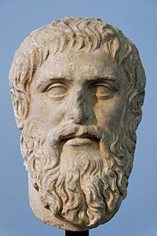

<!--
_backgroundColor: #556B2F
_color: #F5FFFA
-->

#### Philosophie  <!-- fit -->
# Leçon 1 
# *La vérité se cache-t-elle ?*

 

 

 

*Diaporama : naviguer avec **← →***

---

---

<!-- paginate: true -->

## 1. L'allégorie de la caverne

 

> Figure-toi des hommes dans une demeure souterraine, en forme de caverne, ayant sur toute sa largeur une entrée ouverte à la lumière; ces hommes sont là depuis leur enfance,les jambes et le cou enchaînés, de sorte qu'ils ne peuvent bouger ni voir ailleurs que devant eux, la chaîne les empêchant de tourner la tête.

 

*Platon, République, Livre VII*

---

- d
- d

---

#### Pour passer en 2 colonnes :

#